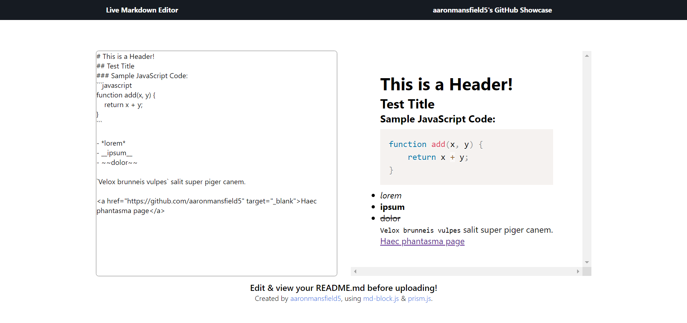

# Markdown Editor

Markdown Editor is a simple, yet powerful web-based Markdown editor that allows you to edit and preview your README files in real-time before uploading them to your GitHub repositories.

## Features
Real-time preview of the Markdown content
Support for GitHub Flavored Markdown
Responsive design suitable for desktop and mobile devices
Syntax highlighting for code blocks using Prism.js
## Usage
Open the index.html file in your web browser.
Start typing your Markdown content in the left textarea (sample content provided by default).
The right panel will automatically update with a live preview of the Markdown content.
## Dependencies
[md-block.js](https://md-block.verou.me/) - Custom element for rendering Markdown content

[Prism.js](https://prismjs.com/) - Syntax highlighting for code blocks
## Credits
Created by [aaronmansfield5](https://github.com/aaronmansfield5), using [md-block.js](https://md-block.verou.me/) & [prism.js](https://prismjs.com/).
